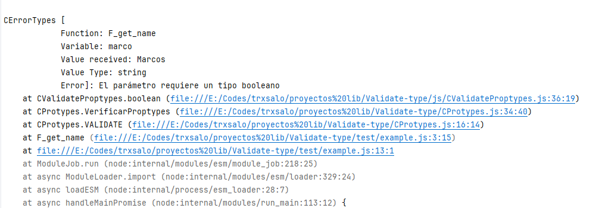
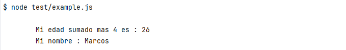
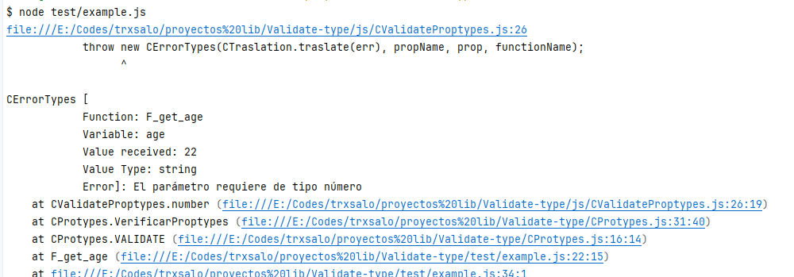

# COMO USAR ESTA PEQUEÑA LIBRERIA(si es que se le puede llamar asi xd)


## Ejemplo #1
 ```javascript
     function F_get_name(marco,edad){
      CProtypes.VALIDATE(F_get_name,arguments);
      if (marco === true) console.log('Sin error')
     }
     
     
     F_get_name.prototype = {
      marco: PropTypes.boolean(),
      edad:PropTypes.string(),
     }
     
     F_get_name('Marcos', '10');
 ```


## Ejemplo #2
```javascript
  const MARCOS = {
   age: 22,
   name:"Marcos",
   nacionality:''
  }
  function F_get_age({age,name,nacionality}){
    CProtypes.VALIDATE(F_get_age,arguments);
    console.log(`
           Mi edad sumado mas 4 es : ${age+4}
           Mi nombre : ${name}
           `);
  };
  
  F_get_age.prototype = {
   age: PropTypes.number(),
   name:PropTypes.string(),
   nacionality: PropTypes.string()
  }
  F_get_age(MARCOS);
```

</br>
```javascript
const MARCOS = {
 age: '22',
 name:"Marcos",
 nacionality:''
}
  function F_get_age({age,name,nacionality}){
    CProtypes.VALIDATE(F_get_age,arguments);
    console.log(`
           Mi edad sumado mas 4 es : ${age+4}
           Mi nombre : ${name}
           `);
  };
  
  F_get_age.prototype = {
   age: PropTypes.number(),
   name:PropTypes.string(),
   nacionality: PropTypes.string()
  }
  F_get_age(MARCOS);
```



## Pendientes
 --[*] Implementar los valores requeridos(forzar que tengan valores) 28/02/2024
</br>
 --[] Implementar Objetos , y de aquellos valores esperados sean definido tando de typos y si son requeridos(Bob esponja esta loco!!!)
 </br>
 --[] Implementar el usos de modulos
 </br>
